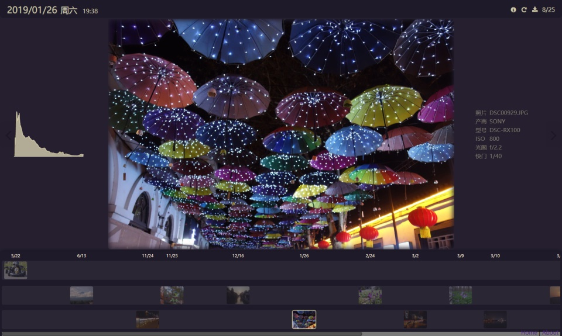

# photo-library

一个时间轴功能的相册

## 界面参考

[Liep9](https://space.bilibili.com/313485/)的[白箱时间轴](https://bbs.saraba1st.com/2b/thread-1107321-1-1.html)

> 4年前看到的这个网站，现在应该服务器关了吧，当时还是因为学AE在B站发现的P9大佬。前阵子偶然想起了这个，觉得可以做个相册小工具。

## 预览

* Github: https://summerscar.me/photo-library/
* Gitee: https://summerscar.gitee.io/photo-library

## 环境需求

* nodejs v7.8+
* ImageMagick
    * MacOS:  ```brew install imagemagick```
    * Windows: [Download](http://www.imagemagick.com.cn/download.html) (需配置环境变量)

## 运行

1. 安装依赖

    ```bash
    git clone git@github.com:summerscar/photo-library.git
    cd photo-library
    yarn
    ```

2. **照片**（带有Exif信息的JPG） 放入至 /photos 文件夹

3. 压缩并生成照片数据

    ```yarn photos```

4. 运行项目

    ```yarn serve```

5. 生成静态页面

    ```yarn build```

## TODO

* 移动端支持
* PWA支持

## 预览


